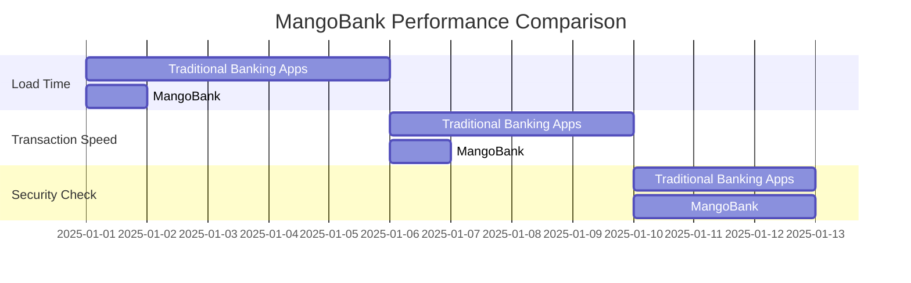
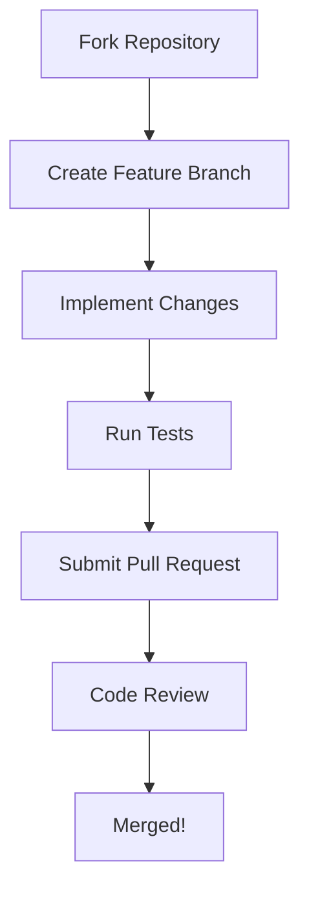

#  MangoBank

<div align="center">


</div>


## :busts_in_silhouette: Our Team

<div align="center">

<table>
  <tr>
    <td align="center">
      <a href="https://github.com/laur221">
        <br />
        <sub><b>Pînzaru Laurențiu</b></sub>
      </a><br />
      <sub>Founder & Solo Developer</sub>
    </td>
  </tr>
</table>

</div>

---

<div align="center">


### ⭐ A Modern Banking Experience Reimagined ⭐

*Your finances, simplified and secured with cutting-edge technology*

[Features](#features) • [Live Demo](#live-demo) • [Installation](#installation) • [Technology Stack](#technology-stack) • [Contributing](#contributing)

</div>

---

## :rocket: Welcome to MangoBank!

MangoBank isn't just another banking application—it's a revolution in digital finance. We've combined sleek design with powerful functionality to create an experience that makes managing your money not just easy, but enjoyable.

<details>
<summary><b>🌈 Our Vision</b></summary>
<br>
<blockquote>
We believe financial tools should be accessible to everyone, regardless of technical expertise. MangoBank bridges the gap between complex banking systems and everyday users, empowering people to take control of their financial future with confidence and ease.
</blockquote>
</details>

## :fire: Features

<div align="center">

### :credit_card: Smart Card Management
Effortlessly manage multiple cards through our intuitive interface. Instantly freeze suspicious activity, set spending limits, and receive real-time notifications for all transactions. Personalize your cards with customizable settings tailored to your financial habits.

### :bar_chart: Intuitive Dashboard
Our elegant, information-rich dashboard provides a comprehensive overview of your finances at a glance. Interactive charts visualize spending patterns, income flows, and savings growth, empowering you to make informed financial decisions.

### :lock: Bank-Grade Security
Your financial security is our top priority. Our multi-layered protection includes biometric authentication, end-to-end encryption, and advanced fraud detection algorithms that monitor your account 24/7, keeping your money safe and secure.

### :money_with_wings: Seamless Transactions
Experience friction-free banking with instant transfers, scheduled payments, and smart recurring transaction management. Our intelligent system remembers your preferences and frequent contacts, making every transaction faster and simpler.

</div>

## :sparkles: What Makes MangoBank Special?

- :bulb: **Simple & Intuitive** — Banking shouldn't be complicated. Our clean interface makes managing your money effortless.
- :zap: **Lightning Fast** — No more waiting around. Everything loads instantly so you can focus on what matters.
- :lock: **Bank-Grade Security** — Sleep peacefully knowing your money is protected by enterprise-level security standards.
- :iphone: **Responsive Design** — Whether you're on your phone, tablet, or computer - MangoBank works flawlessly everywhere.
- :crescent_moon: **Dark Mode Support** — Easy on the eyes, day or night. We've got you covered with beautiful light and dark themes.
- :bell: **Smart Notifications** — Stay informed with customizable alerts for transactions, security, and account updates.

## :chart_with_upwards_trend: Performance Metrics



## :dart: Ready to Get Started?

<details open>
<summary><b> 🚀 Quick Setup (for developers)</b></summary>

```bash
# Clone the repository
git clone https://github.com/laur221/MangoBank.git

# Navigate to project directory
cd MangoBank

# Install dependencies
npm install

# Start the development server
npm run dev
```

Visit `http://localhost:3000` and see the magic happen! ✨

</details>

## :wrench: Technology Stack

<div align="center">

| Frontend | Backend | Database | Deployment |
|:--------:|:-------:|:--------:|:----------:|
|  |  |  |  |
|  | | | |
|  | | | |

</div>

## :clipboard: Roadmap

- [x] Initial project setup
- [x] User authentication system
- [x] Basic dashboard interface
- [ ] Transaction history and filtering
- [ ] Push notifications
- [ ] Mobile app versions
- [ ] API integrations with financial services
- [ ] International money transfers

## :handshake: Contributing

We welcome contributions from everyone! Here's how you can help:



## :page_facing_up: License

This project is licensed under the MIT License - see the [LICENSE](LICENSE) file for details.

## :bar_chart: Project Stats

<div align="center">

[](https://github.com/laur221/MangoBank/graphs/contributors)
[](https://github.com/laur221/MangoBank/network/members)
[](https://github.com/laur221/MangoBank/commits/main)
[](https://github.com/laur221/MangoBank)

</div>

## :email: Contact & Community

We'd love to hear from you! Here are all the ways you can reach us:

<div align="center">

### :mailbox: Direct Contact

[](mailto:contact@mangobank.com)
[](https://www.linkedin.com/in/p%C3%AEnzaru-lauren%C8%9Biu-b21408294/)


### :headphones: Support Options

| Type | Response Time | Link |
|:----:|:-------------:|:----:|
| General Inquiries | 24-48 hours | [support@mangobank.live](mailto:support@mangobank.live) |
| Technical Support | 12-24 hours | [tech@mangobank.live](mailto:tech@mangobank.live) |


### :speech_balloon: Community

<details>
<summary><b>Join Our Community</b></summary>
<br>

- **Monthly Webinars**: Learn about finance management tips and new features
- **Developer Forums**: Exchange ideas and get help with the API
- **User Groups**: Connect with other MangoBank users in your area

Follow our GitHub repository to stay updated!

</details>

---

<div align="center">

### :star: Star us on GitHub — it helps!

<p align="center">Built with ❤️ using Next.js and modern web technologies</p>

<!-- Hidden joke for developers who read source code -->
<!-- Why did the developer go broke? Because he used up all his cache! -->

</div>
